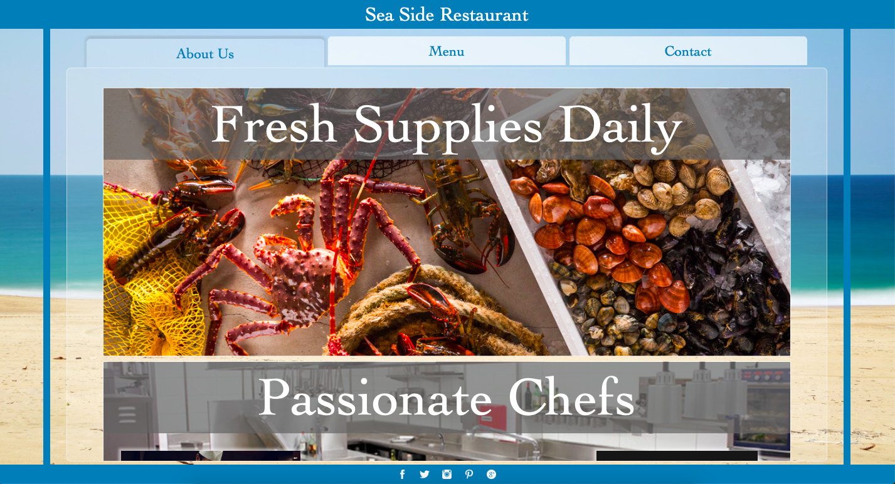
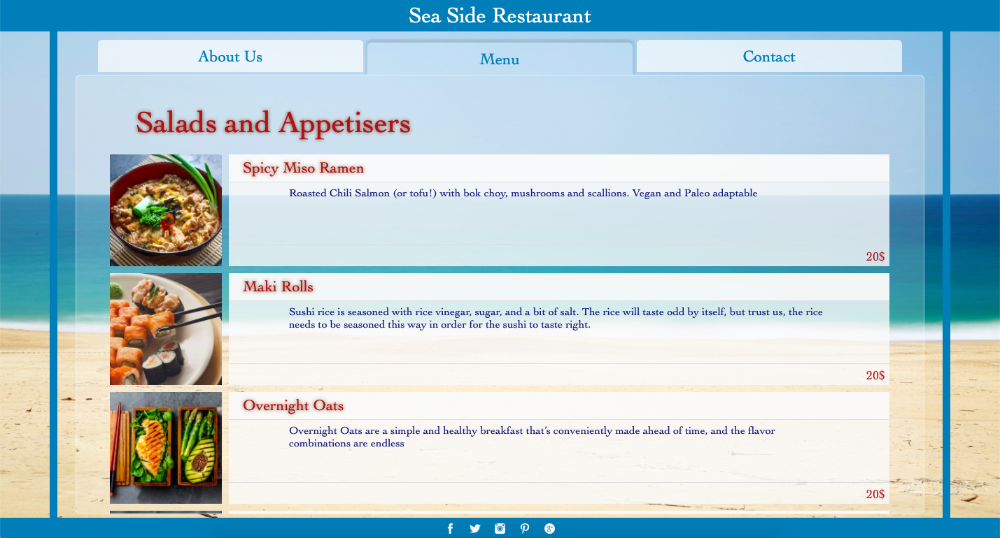
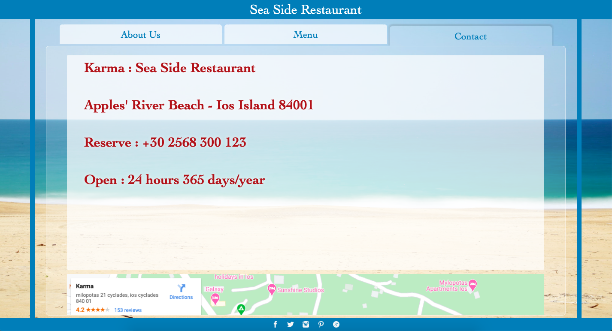

# Restaurant Page

<!--
*** Thanks for checking out this README Template. If you have a suggestion that would
*** make this better, please fork the repo and create a pull request or simply open
*** an issue with the tag "enhancement".
*** Thanks again! Now go create something AMAZING! :D
-->

<!-- PROJECT SHIELDS -->
<!--
*** I'm using markdown "reference style" links for readability.
*** Reference links are enclosed in brackets [ ] instead of parentheses ( ).
*** See the bottom of this document for the declaration of the reference variables
*** for contributors-url, forks-url, etc. This is an optional, concise syntax you may use.
*** https://www.markdownguide.org/basic-syntax/#reference-style-links
-->

[![Contributors][contributors-shield]][contributors-url]
[![Forks][forks-shield]][forks-url]
[![Stargazers][stars-shield]][stars-url]
[![Issues][issues-shield]][issues-url]

<!-- PROJECT LOGO -->
<br />
<p align="center">
  <a href="https://github.com/ioanniskousis/Restaurant">
    
  </a>
  
  <h3 align="center">The Restaurant Page Application</h3>
  
  <p align="center">
    This project is part of the Microverse curriculum in JavaScript course!
    <br />
    <a href="https://ioanniskousis.github.io/Restaurant/"><strong>Live Version</strong></a>
    <br />
    <a href="https://github.com/ioanniskousis/Restaurant"><strong>Explore the docs »</strong></a>
    <br />
    <br />
    <a href="https://github.com/ioanniskousis/Restaurant/issues">Report Bug</a>
    <a href="https://github.com/ioanniskousis/Restaurant/issues">Request Feature</a>
  </p>
</p>

A restaurant's web page built with HTML5, CSS3 and JavaScript

<hr />

## Application Screen Shots  


<hr />

<hr />

<hr />

<!-- TABLE OF CONTENTS -->

## Table of Contents

- [About the Project](#about-the-project)
- [Application Instructions](#application-instructions)
- [System Requierments](#system-requierments)
- [Development](#development)
- [Live Version](#live-version)
- [Built With](#built-with)
- [Contributors](#contributors)
- [Acknowledgements](#acknowledgements)

<!-- ABOUT THE PROJECT -->

## About The Project  

  The project is implemented using an HTML page - the index.html.  
  Webpack is used having configured as follows  
    - entry  : /src/index.js  
    - output : dist/main.js  
    - Images are compiled using file-loader  
    - CSS is compiled using style-loader  

  The mark-up file dist/index.html only contains a skeleton that is rendered with elements depending on which view is selected by the user between 3.  
    - About Us, rendered by aboutUs.js  
    - Menu, rendered by menu.js fed with data from menuItems.js  
    - Contact, rendered by contacts.js  
  The page footer is rendered by the footer.js  
  The navigation division is rendered by navigator.js  

  The navigation buttons are supplied a pointer to a callback function (the navigatorCallBack function) from the index.js and this is called when a button is clicked providing the index of the button as a parameter.  

<hr/>

<!-- ABOUT THE PROJECT -->

## Application Instructions  

  Use the three buttons in the navigator at the top of the page to move between the About page, the Menu page, and the Contact page.  

<hr/>

## System Requirements
  - JavaScript Enabled  
  - You need to Disable Cross-Origin-Restrictions from your browser if you want to open the index.html from your file system without using a server.  

<hr/>

## Development
  * Clone the project
  ```
    https://github.com/ioanniskousis/Restaurant.git
    
    Use VSCode and Live Server to show index.html
    Since webpack is used, run 'npm run build' on you terminal before opening
  ``` 
<hr/>

## Live Version

  [Restaurant Page](https://ioanniskousis.github.io/Restaurant/)

<hr/>

## Built With

This project was built using these technologies.

  - JavaScript (ES6)
  - HTML5
  - CSS3
  - Webpack
  - Git - GitHub
  - ESLint
  - Stylelint
  - Stickler

<hr/>

<!-- CONTACT -->

## Contributors

:bust_in_silhouette:
​
## Ioannis Kousis

- Github: [@ioanniskousis](https://github.com/ioanniskousis)
- Twitter: [@ioanniskousis](https://twitter.com/ioanniskousis)
- Linkedin: [Ioannis Kousis](https://www.linkedin.com/in/jgkousis)
- E-mail: jgkousis@gmail.com
​
<hr/>
<!-- ACKNOWLEDGEMENTS -->

## Acknowledgements

  - [Microverse](https://www.microverse.org/)
  - [The Odin Project](https://www.theodinproject.com/)


<!-- MARKDOWN LINKS & IMAGES -->
<!-- https://www.markdownguide.org/basic-syntax/#reference-style-links -->

[contributors-shield]: https://img.shields.io/github/contributors/ioanniskousis/Restaurant.svg?style=flat-square
[contributors-url]: https://github.com/ioanniskousis/Restaurant/graphs/contributors
[forks-shield]: https://img.shields.io/github/forks/ioanniskousis/Restaurant.svg?style=flat-square
[forks-url]: https://github.com/ioanniskousis/Restaurant/network/members
[stars-shield]: https://img.shields.io/github/stars/ioanniskousis/Restaurant.svg?style=flat-square
[stars-url]: https://github.com/ioanniskousis/Restaurant/stargazers
[issues-shield]: https://img.shields.io/github/issues/ioanniskousis/Restaurant.svg?style=flat-square
[issues-url]: https://github.com/ioanniskousis/Restaurant/issues
